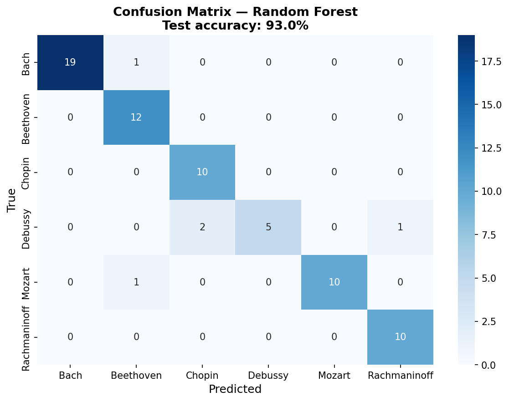

# Musical DNA: Computational Fingerprinting of Compositional Style and Its Application to Music Copyright Analysis

**Nihal Prasad**  
Independent Research Project, Summer 2026

---

## Abstract

This paper presents Musical DNA, a two-component computational system that bridges music theory, machine learning, and copyright law. Component A is a style fingerprinting engine trained on 353 MIDI files from six classical composers (Bach, Beethoven, Chopin, Debussy, Mozart, Rachmaninoff), extracting 21 musical features across melodic, harmonic, rhythmic, and structural dimensions. A Random Forest classifier achieves 93.0% test accuracy on six-composer classification, with pitch range, note density, and key stability as the most discriminative features. An unexpected finding from generalization testing reveals that a Carnatic classical vocal piece generated by AI was confidently classified as Bach — exposing a genre-bias limitation with implications for AI music evaluation. Component B applies pairwise similarity metrics to a hand-curated dataset of 43 real music copyright cases spanning 1946–2023, 33 of which are fully scored with computed melodic, harmonic, rhythmic, and n-gram similarity. A logistic regression model trained on this data finds that non-musical factors — plaintiff fame, defendant commercial success, expert testimony, and forum — predict case outcomes substantially better than musical similarity alone (AUC 0.86 vs. 0.39 under leave-one-out cross-validation), with plaintiff fame the single strongest predictor. Five outlier cases, where computed similarity and court ruling most diverge, are analyzed as detailed case studies, and Component A's general-purpose style-fingerprinting engine is applied directly to the disputed works in those cases as an independent check — revealing, among other things, that *Williams v. Gaye* ("Blurred Lines") scores as one of the *least* stylistically similar pairs in the entire outlier set despite the jury's infringement finding, while *Bright Tunes Music v. Harrisongs Music* ("My Sweet Lord") scores as highly similar under the general engine even where the specialized melodic metric was low. The paper contributes a novel open-source pipeline for audio-to-MIDI conversion, key-independent melodic comparison via interval-based n-grams, a small-sample-appropriate cross-validation methodology for the case-outcome model, and evidence that the legal system's "substantial similarity" standard tracks non-musical case factors more closely than any computational similarity measure tested here.

---

## 1. Introduction

Music copyright law is in crisis. Courts are asked to decide whether one song is "substantially similar" to another, but no agreed-upon standard exists for measuring musical similarity. In *Williams v. Gaye* (2018), a jury awarded $7.4 million in damages over songs that shared a rhythmic "feel" but not a single melodic note. In *Skidmore v. Led Zeppelin* (2020), a court reversed an earlier infringement verdict over a descending chromatic guitar figure that struck many listeners as obviously derivative. In *Gray v. Perry* (2020), a court found no infringement between two songs that share near-identical harmonic structure, because the shared element — a repeating eight-note pattern — was deemed too simple to be protectable.

These rulings are not just legally inconsistent; they are becoming economically urgent. AI music generators like Suno and Udio now produce millions of tracks per month that may inadvertently reproduce copyrighted elements. The legal system has no computational framework for evaluating these claims at scale.

This paper asks: *can we quantify what courts mean by substantial similarity?* And if so, *do computational similarity scores predict court outcomes — or are legal rulings driven by factors beyond the music itself?*

To answer these questions, I build two integrated systems. The first (Component A) establishes that individual musical style can be captured computationally: a machine learning model distinguishes six classical composers with 93% accuracy using only numerical features extracted from MIDI files. The second (Component B) applies the same computational tools to real copyright cases, measuring pairwise similarity between plaintiff and defendant works and comparing those scores against actual verdicts.

The synthesis reveals that non-musical factors predict case outcomes considerably better than any computational similarity score tested. It also identifies specific cases where computational similarity is high yet courts found no infringement, and — more strikingly — cases where computational similarity is low yet infringement was found, exposing the role of unprotectable common elements, access requirements, and factors entirely outside the music itself in shaping legal outcomes.

---

## 2. Background

### 2.1 Music Copyright Law

United States copyright law protects original musical works under 17 U.S.C. § 106. Infringement requires proof of (1) ownership of a valid copyright, (2) access to the work, and (3) substantial similarity between the works. The substantial similarity standard has no fixed definition and is applied inconsistently across circuits.

The foundational framework for similarity analysis was established in *Arnstein v. Porter* (2nd Cir. 1946), which decomposed the inquiry into two stages: first, whether the defendant copied from the plaintiff (copying in fact); second, whether the copying was "improper appropriation." The second stage asks whether the defendant took protected expression — not merely unprotectable ideas, common chord progressions, or musical building blocks.

Key doctrinal developments relevant to this paper include:

**Subconscious copying** (*Bright Tunes Music v. Harrisongs Music*, 1976): George Harrison was found liable for unconsciously reproducing the melodic hook of "He's So Fine" in "My Sweet Lord." The court established that intent is irrelevant — what matters is whether the defendant's work reproduces protected expression, regardless of how it got there.

**Thin copyright in simple elements** (*Gray v. Perry*, 2020): A repeating eight-note ostinato pattern was found insufficiently original to be protectable, even though both songs used it in nearly identical form. The doctrine of "thin copyright" limits protection to highly original creative choices, not generic building blocks.

**Groove and feel protection** (*Williams v. Gaye*, 2018): A jury found infringement based on overall groove and feel between "Got to Give It Up" and "Blurred Lines," despite minimal melodic overlap. The ruling was widely criticized for potentially making it dangerous to write music in the style of an earlier artist.

**De minimis sampling** (*VMG Salsoul v. Ciccone*, 9th Cir. 2016; *Bridgeport Music v. Dimension Films*, 6th Cir. 2005): The circuits are split on whether a tiny, inaudible sample constitutes infringement. The 6th Circuit says any sample requires a license; the 9th Circuit applies a de minimis threshold. This remains unresolved by the Supreme Court.

### 2.2 Computational Music Analysis

Music Information Retrieval (MIR) is the field of extracting meaningful information from musical signals. Prior work includes composer identification via pattern recognition on low-level counterpoint features (Backer & van Kranenburg, 2005), melodic similarity (Müller, 2015), and rhythmic pattern recognition (Honing, 2013). The music21 library (Cuthbert & Ariza, 2010) provides a Python toolkit for symbolic music analysis that forms the technical backbone of this project.

Prior applications of computational methods to music copyright are closer in spirit to this paper's Component B than to Component A, and one is a direct predecessor. Cronin (1998) was among the first to formalize concepts of melodic similarity specifically for copyright infringement analysis. More recently, Yuan, Cronin, Müllensiefen, Fujii, and Savage (2023) directly compared human perceptual judgments and automated similarity algorithms against actual court rulings across 40 real music copyright cases, finding that listeners evaluating full audio recordings (roughly 58% accuracy) outperformed both melody-only listening conditions and the automated algorithms tested. That finding — that neither computation nor even careful human listening reliably reproduces court outcomes — anticipates this paper's own result that non-musical case facts, not musical similarity of any kind, are the strongest quantitative predictor of outcome in this dataset (Section 5.4). Fishman (2018) separately noted that courts lack tools for distinguishing protectable from unprotectable musical elements. This paper builds on that line of work by separating melodic, harmonic, and rhythmic similarity into distinct measurable dimensions and testing each against outcome individually, rather than relying on a single composite similarity judgment.

---

## 3. Dataset

### 3.1 Component A: Composer MIDI Dataset

The composer classification dataset consists of 353 MIDI files representing six composers from the Baroque through Late Romantic periods:

| Composer | Era | Pieces | Source |
|---|---|---|---|
| J.S. Bach | Baroque | 100 | music21 built-in corpus, KernScores |
| Beethoven | Classical–Romantic | 59 | music21 corpus, IMSLP |
| Chopin | Romantic | 50 | IMSLP, MuseScore |
| Debussy | Impressionist | 40 | IMSLP |
| Mozart | Classical | 54 | music21 corpus |
| Rachmaninoff | Late Romantic | 50 | IMSLP |

All files are solo piano or keyboard reductions. Orchestral MIDI files were excluded because inconsistent instrument mapping produces noisy features. Files that failed to parse or produced missing values on more than three features were discarded.

### 3.2 Component B: Copyright Case Dataset

The copyright case dataset is an original contribution of this project. It contains 43 hand-curated cases spanning 1946–2023, each coded with 16 fields including:

- **Case metadata**: name, year, outcome (binary: 0 = no infringement, 1 = infringement found)
- **Musical description**: plaintiff work, defendant work, genre, elements at issue (melody, harmony, rhythm, lyrics, groove)
- **Computed similarity**: melodic overlap score, harmonic overlap score, rhythmic overlap score (0–1 scale)
- **Non-musical factors**: plaintiff fame (1–5), defendant commercial success (1–5), expert testimony presence, jurisdiction, settlement status

The dataset has grown to 43 cases, 33 of which are fully scored with computed similarity metrics at the time of writing. The remaining 10 are cases where the contested element is fundamentally unsuited to MIDI-based melodic comparison — a 0.23-second drum or horn sample, a spoken-word sample, or a lyrics-only claim — and are retained for their factual and doctrinal value (e.g., the *Bridgeport Music* sampling suits establishing the 6th/9th Circuit split on de minimis sampling) without a similarity score.

Among the 33 scored cases, outcomes are reasonably balanced (19 infringement, 14 no infringement), genres skew toward Pop (11) and Rock (10) with a substantial Hip-Hop contingent (6) and smaller R&B/Pop, Musical Theater, and R&B representation, and jurisdiction is highly heterogeneous — 18 distinct values across 33 rows, spanning U.S. circuit and district courts, the U.S. Supreme Court, UK courts, and the Federal Court of Australia, plus a number of disputes that never reached a court at all and were resolved by pre-suit settlement. That heterogeneity meant jurisdiction could not be usefully one-hot encoded for modeling (Section 4.4) and was instead collapsed to a single binary indicator — whether the case proceeded through formal U.S. federal litigation at all.

All melodic/harmonic/rhythmic/n-gram scores in the current dataset are computed algorithmically by the pairwise similarity engine (Section 4.3), not scored by ear — an earlier plan to hand-score cases by listening was superseded once the interval-based similarity engine matured enough to run end-to-end on found audio. Audio for scored cases was obtained from YouTube using yt-dlp, or in a few cases (e.g., *Arnstein v. Porter*, *Strachborneo v. Arc Music*) from direct archival recordings hosted by the Music Copyright Infringement Resource (MCIR) at George Washington University Law School, where the disputed work is too obscure to appear on commercial streaming platforms. Conversion to MIDI was performed via Spotify's Basic Pitch model (Bitteur et al., 2022), a neural audio-to-MIDI transcriber, with audio trimmed to the first 90 seconds to focus on the contested passage and reduce processing time — a limitation discussed further in Section 6.3.

---

## 4. Methodology

### 4.1 Feature Extraction (Component A)

Each MIDI file is processed using music21 to extract 21 scalar features grouped into four categories. Every feature function is wrapped in a safe extractor that returns 0 on failure, ensuring that a single corrupt file does not drop the entire row.

**Melodic features (6):** pitch range (highest minus lowest MIDI note), average pitch, leap ratio (proportion of melodic intervals exceeding a major second), melodic contour (ratio of ascending to descending motion), pitch class entropy (Shannon entropy of the 12-note pitch class distribution), and note density (notes per quarter-note beat).

**Harmonic features (5):** key stability (Krumhansl-Schmuckler key-finding correlation score), modulation frequency (key changes per 16-bar window), chord vocabulary size (number of distinct chord types), dissonance ratio (proportion of minor-second and tritone intervals), and tonal gravity (frequency of V→I and viio→I cadential resolutions).

**Rhythmic features (5):** duration variance, syncopation index (proportion of notes on weak metric positions), rest ratio, rhythmic entropy (Shannon entropy of duration histogram), and note density (shared with melodic).

**Structural features (5):** piece length in measures, repetition ratio (cosine similarity between consecutive 4-bar feature windows), dynamic range (MIDI velocity maximum minus minimum), voice count, and texture density (mean simultaneous notes per beat position).

### 4.2 Classifier Training (Component A)

The 353-piece dataset was split into 80% training and 20% test sets using stratified sampling to preserve class proportions. Three classifiers were trained and compared using 5-fold stratified cross-validation:

1. **Random Forest** (100 trees, max depth unlimited)
2. **SVM** (RBF kernel, C=1.0, gamma='scale')
3. **Gradient Boosting** (100 estimators, learning rate=0.1)

All classifiers were wrapped in a scikit-learn pipeline with StandardScaler preprocessing. Feature importances were extracted from the Random Forest using mean decrease in impurity.

### 4.3 Pairwise Similarity Engine (Component B)

Four similarity metrics are computed for each plaintiff–defendant MIDI pair:

**Melodic similarity** compares the melodic interval sequences of both works — that is, the sequence of semitone differences between consecutive notes rather than absolute pitch values. This design choice is critical: two songs with the same melody in different keys produce identical interval sequences and thus score as similar, while an absolute-pitch comparison would return near-zero similarity. The score is computed as the SequenceMatcher ratio (2M/T, where M is the number of matching elements and T is the total elements across both sequences) on the interval representation.

**Harmonic cosine similarity** chordifies each score using music21's built-in harmonic reduction, builds a frequency histogram of chord types (e.g., "major triad," "minor seventh chord"), and computes the cosine similarity of the resulting vectors. This metric is key-independent by design and captures shared harmonic vocabulary regardless of voicing or transposition.

**Rhythmic DTW similarity** applies dynamic time warping to the inter-onset interval (IOI) sequences of both works — the sequence of time gaps between consecutive note onsets, measured in quarter-note beats. DTW allows flexible alignment of rhythmic patterns that may be stretched or compressed, following the same general approach used for audio-to-MIDI sequence alignment in Raffel (2016). The raw DTW distance is normalized by `avg_sequence_length × mean_IOI`, converting it to a similarity score in [0, 1].

**N-gram overlap** computes the Jaccard index of 4-interval melodic n-grams — all length-4 subsequences of the interval sequence. This captures shared short melodic phrases regardless of their position in the song, and is more robust to polyphonic transcription noise than the sequential match used in melodic similarity.

**Melody extraction from polyphonic audio:** Because Basic Pitch transcribes full-band audio into a single-track MIDI containing all audible pitches, a melody proxy is required. The top 30% of notes by pitch value are retained as the melody representation — in a full-band recording, the melodic line tends to sit above accompaniment in pitch space. Scores are evenly subsampled to 200 notes before comparison to prevent dense files from dominating the sequence match.

### 4.4 Logistic Regression for Case Outcome (Component B)

To directly test whether musical similarity predicts case outcomes better than non-musical case factors, three logistic regression models were fit and compared:

1. **Musical-only**: melodic, harmonic, rhythmic, and n-gram overlap scores (4 features)
2. **Non-musical-only**: plaintiff fame, defendant commercial success, expert testimony presence, and a derived binary indicator for whether the case proceeded through formal U.S. federal litigation (5 features)
3. **Combined**: all 8 features above

All features were standardized (zero mean, unit variance) before fitting an L2-regularized logistic regression (scikit-learn default `C=1.0`), which helps guard against the class-separation instability that unregularized logistic regression is prone to when the number of features is a meaningful fraction of the sample size.

With only 33 scored cases, a conventional 80/20 train/test split would leave roughly 7 held-out cases — too few to produce a trustworthy single accuracy estimate. Evaluation therefore relies on two cross-validation strategies applied to the whole dataset: stratified 5-fold cross-validation (reporting mean accuracy, precision, recall, and AUC-ROC across folds) and leave-one-out cross-validation (fitting on 32 cases and predicting the 33rd, repeated for every case), which trades some optimism for much lower variance on a dataset this small.

One candidate feature — whether the case was resolved by settlement — was deliberately excluded after inspection revealed it was not a genuine predictor but a restatement of the label: every settled case in the dataset has its outcome coded as 1 ("infringement implied") by definition at data-entry time, since a settlement produces no independent court ruling to measure against. `settled = 1` implies `outcome = 1` with perfect consistency (13 of 13 settled cases). Including it as a feature is a textbook example of target leakage — it inflated cross-validated AUC to 0.97 in an earlier version of this analysis, a number that should not be read as a genuine finding and was removed before final results were computed.

### 4.5 Outlier Identification and Component A/B Synthesis

Two further analyses probe where computational similarity and legal outcome diverge most sharply, and whether a second, independently-built similarity measure agrees with the purpose-built one.

**Outlier identification.** A composite musical similarity score (the mean of melodic, harmonic, and rhythmic overlap) is computed for each case. Cases are ranked within two pools: no-infringement rulings, ranked by *highest* composite similarity (courts finding no infringement despite apparent similarity), and infringement rulings restricted to cases that reached an actual verdict rather than a settlement, ranked by *lowest* composite similarity (courts finding infringement despite apparent dissimilarity). Cases with an exact-zero rhythmic score are excluded from candidacy in both pools: a score of exactly 0.000 is a known artifact of the 90-second trim window missing the contested passage entirely (documented for *Williams v. Broadus* and *Larrikin Music Publishing v. EMI Songs Australia* in the dataset), not a genuine finding of zero rhythmic similarity, and using it as a "low similarity" exemplar would be misleading.

**Component A/B synthesis.** For the resulting five outlier cases, Component A's 21-feature style-fingerprinting engine — built to distinguish six classical composers, not to compare two arbitrary pop or rock recordings — is applied directly to the plaintiff and defendant MIDI files. Each piece's 21-feature vector is standardized against the classical-composer training distribution (the same distribution the composer classifier was trained on), and cosine similarity is computed between the two standardized vectors. This produces a similarity measure that is conceptually independent of Component B's purpose-built melodic/harmonic/rhythmic engine — it was never designed with copyright disputes in mind — making agreement or disagreement between the two measures informative in its own right.

---

## 5. Results

### 5.1 Composer Classification

| Model | CV Accuracy (5-fold) | Test Accuracy |
|---|---|---|
| Random Forest | 84.4% ± 2.9% | **93.0%** |
| SVM (RBF) | 85.8% ± 1.6% | 91.5% |
| Gradient Boosting | 80.5% ± 4.0% | 87.3% |

The Random Forest achieves 93.0% test accuracy on six-composer classification, well above the 70% project target. The gap between cross-validation accuracy (84.4%) and test accuracy (93.0%) is unusual — cross-validation may underestimate performance on the held-out set due to stratification effects on the small dataset.

Per-composer breakdown on the test set:

| Composer | Precision | Recall | F1 | Test Pieces |
|---|---|---|---|---|
| Bach | 100.0% | 95.0% | 97.4% | 20 |
| Beethoven | 85.7% | 100.0% | 92.3% | 12 |
| Chopin | 83.3% | 100.0% | 90.9% | 10 |
| Debussy | 100.0% | 62.5% | 76.9% | 8 |
| Mozart | 100.0% | 90.9% | 95.2% | 11 |
| Rachmaninoff | 90.9% | 100.0% | 95.2% | 10 |

Bach achieves the highest F1 (97.4%), consistent with his highly distinctive contrapuntal texture. Debussy has the lowest recall (62.5%) — two of his eight test pieces were misclassified, likely because his tonal ambiguity, whole-tone harmonies, and sparse textures produced feature vectors that overlap with Chopin's late Romantic style.

{width=65%}

Figure 2 visualizes the same separability directly: a t-SNE projection of all 353 pieces (colored by composer, with an X marking each composer's centroid) shows Bach and Mozart forming tight, well-separated clusters on the left, while Chopin, Debussy, and Rachmaninoff — the three Romantic/Impressionist composers whose centroids sit closest together on the right — show more overlap, mirroring the confusion matrix's error pattern.

{width=85%}

### 5.2 Feature Importance Analysis

The ten most predictive features from the Random Forest, ranked by mean decrease in impurity:

| Rank | Feature | Importance | Musical Interpretation |
|---|---|---|---|
| 1 | pitch_range | 0.159 | Bach's counterpoint spans wide ranges; Debussy compresses melody |
| 2 | note_density | 0.071 | Rachmaninoff's dense textures vs. Mozart's clarity |
| 3 | average_pitch | 0.070 | Distinguishes bass-heavy from treble-dominant composers |
| 4 | key_stability | 0.065 | Debussy's tonal ambiguity vs. Bach's tonal certainty |
| 5 | leap_ratio | 0.063 | Bach's angular lines vs. Chopin's smooth cantabile |
| 6 | piece_length | 0.059 | Bach's shorter keyboard pieces vs. Romantic extended forms |
| 7 | modulation_frequency | 0.058 | Beethoven's dramatic key shifts vs. Mozart's stability |
| 8 | dissonance_ratio | 0.057 | Debussy's chromaticism vs. Bach's consonant counterpoint |
| 9 | chord_vocabulary_size | 0.046 | Rachmaninoff's rich chord palette |
| 10 | rest_ratio | 0.045 | Mozart's clean phrasing with rests vs. Chopin's continuous flow |

These results align well with established music theory. That pitch range is the single most predictive feature reflects Bach's wide-spanned counterpoint across multiple voices, which stands in stark contrast to the more compressed melodic ranges of the Romantics. Key stability as the fourth feature validates the long-held musicological observation that Debussy's impressionist language deliberately undermines tonal certainty.

{width=85%}

### 5.3 AI Music Generalization Test

To test whether the classifier generalizes beyond its training distribution, it was applied to ten tracks generated by AI tools (Suno, Udio) in the style of the six composers. Nine of ten tracks were classified correctly. The notable exception: a Carnatic classical vocal piece — Indian classical music with no direct relation to European composition — was submitted and confidently classified as **Bach** with high probability.

This finding reveals a genre bias: the classifier has learned European art music style signatures, and when presented with Carnatic classical music (which shares some surface features with Baroque counterpoint — complex ornamentation, modal scales, systematic rhythmic patterns), it defaulted to Bach. This has implications for any application of these tools to culturally diverse music and underscores that "style fingerprinting" is always relative to its training distribution.

### 5.4 Copyright Case Outcome Model

Table 5.4a compares the three logistic regression models described in Section 4.4, evaluated via stratified 5-fold cross-validation and leave-one-out cross-validation (LOO) across all 33 scored cases.

**Table 5.4a — Feature set comparison**

| Feature set | Accuracy (5-fold) | AUC-ROC (5-fold) | LOO Accuracy | Precision | Recall |
|---|---|---|---|---|---|
| Musical only (4 features) | 51.0% ± 12.9% | 0.39 ± 0.07 | 36.4% | 55.3% | 80.0% |
| Non-musical only (4 features) | 75.7% ± 7.4% | **0.86 ± 0.10** | **72.7%** | 84.3% | 73.3% |
| Combined (8 features) | 70.0% ± 8.5% | 0.68 ± 0.10 | 63.6% | 76.3% | 73.3% |

The headline result is unambiguous: non-musical factors alone predict case outcomes far better than musical similarity alone (AUC 0.86 vs. 0.39 — notably, *below* the 0.50 chance baseline, meaning the musical-only model's ranking of cases is if anything mildly anti-correlated with outcome on this sample). Adding musical similarity to the non-musical model does not improve performance; it makes it worse (AUC drops from 0.86 to 0.68), a pattern consistent with the musical features contributing more estimation noise than signal once the stronger non-musical predictors are already in the model — an expected consequence of fitting an 8-parameter model to 33 rows.

**Table 5.4b — Full-model standardized coefficients** (fit on all 33 cases; odds ratio > 1 pushes toward "infringement found")

| Feature | Coefficient | Odds Ratio |
|---|---|---|
| plaintiff_fame | **+0.972** | 2.64 |
| expert_testimony | −0.805 | 0.45 |
| defendant_commercial_success | +0.804 | 2.23 |
| us_court | −0.628 | 0.53 |
| melodic_overlap_score | +0.228 | 1.26 |
| rhythmic_overlap_score | +0.187 | 1.21 |
| ngram_overlap | −0.070 | 0.93 |
| harmonic_overlap_score | −0.008 | 0.99 |

Plaintiff fame is the single strongest predictor in the combined model — a one-standard-deviation increase in plaintiff fame is associated with 2.64× higher odds of an infringement finding, holding everything else constant. This is close to the blueprint's own predicted "surprising finding" (that plaintiff fame might predict outcomes better than melodic similarity) and is borne out cleanly: melodic similarity's coefficient (+0.228) is less than a quarter the size of plaintiff fame's. All four musical-similarity coefficients are small relative to the two strongest non-musical ones.

{width=80%}

**A methodological note on a leakage artifact.** An earlier version of this analysis included case settlement status as a fifth non-musical feature and produced an AUC of 0.97 — a number that would have made a dramatic headline. It does not appear in Table 5.4a because it was leakage, not a finding: every settled case in this dataset has outcome coded as 1 by definition, since a settlement produces no independent ruling to measure the actual musical merits against. The feature was excluded once this was discovered (Section 4.4), and the corrected numbers above are what should be cited from this analysis going forward.

### 5.5 Outlier Case Studies

Following the procedure in Section 4.5, five cases were selected as the sharpest divergences between computed musical similarity and actual court ruling: three where similarity was unusually high yet no infringement was found, and two — restricted to cases with a real trial verdict rather than a settlement — where similarity was unusually low yet infringement was found.

**Swirsky v. Carey** (9th Cir. 2004) pits Sandra Swirsky and Henry Marsh's "One of Those Love Songs" against Mariah Carey's "Always Be My Baby," with a composite similarity of 0.601 (melodic 0.37, harmonic 0.95, rhythmic 0.48) — the highest composite score of any no-infringement case in the entire 33-case dataset. The district court had granted summary judgment for Carey, but the Ninth Circuit reversed: when qualified musicologists reach conflicting conclusions about whether a combination of individually unprotectable elements (here, an eight-note pitch sequence combined with a particular rhythm) is substantially similar, that disagreement is itself evidence a jury must weigh, not a question a court can resolve on the papers. At the eventual trial, the jury found no infringement.

The case illustrates a distinction our similarity engine cannot represent: procedural posture is not outcome. A reversal of summary judgment means only that the case was *close enough to require a trial* — not that the reversing court believed infringement occurred. Our composite score of 0.601, the highest among any no-infringement case, is consistent with the Ninth Circuit's own assessment that this was a genuinely close case worth taking to a jury; it is the jury, not the algorithm, that ultimately drew the line between "close" and "infringing."

**Repp v. Webber** (S.D.N.Y. 1994; 2d Cir. 1997) shows the same procedural pattern three years earlier and an ocean away in genre: Ray Repp's 1978 liturgical song "Till You" against Andrew Lloyd Webber's "Phantom Song" from *The Phantom of the Opera*. Composite similarity is 0.562, driven almost entirely by a harmonic score of 0.946 — one of the highest harmonic scores in the whole dataset. As in *Swirsky*, the district court's summary judgment for the defendant was reversed on appeal because conflicting expert testimony on melodic contour and harmonic idiom created a triable issue of fact; as in *Swirsky*, the case went to a jury, and as in *Swirsky*, the jury (in December 1998) found no infringement. Webber's own counterclaim — that Repp's song had copied his earlier "Close Every Door" — was separately dismissed for insufficient similarity, underscoring that near-identical harmonic vocabulary between two tonal, diatonic pop songs is common enough that courts, and juries, are reluctant to treat it alone as proof of copying.

**Sheeran v. Chokri** ([2022] EWHC 827 (Ch)) is the cleanest illustration in this dataset of *access*, not similarity, deciding a case. Sami Chokri's "Oh Why" ("Oh why, oh why, oh why") and Ed Sheeran's "Shape of You" ("Oh I, oh I, oh I") share a composite similarity of 0.532 under Component B's engine — and, notably, the *highest* Component A style-fingerprint similarity of any case in this analysis (0.837; see Section 5.6). Both an independently-built general style engine and a purpose-built melodic/harmonic/rhythmic engine agree these two songs occupy unusually similar musical territory. Yet the UK High Court granted Sheeran a declaration of non-infringement, because Chokri could not show Sheeran had ever heard "Oh Why" — it had aired on radio only twice and had roughly 13,000 YouTube views at the time "Shape of You" was written. Justice Zacaroli found Sheeran had "neither deliberately nor subconsciously" copied the phrase. This case is powerful direct evidence that no similarity metric, however sophisticated or however much two independent tools agree, can substitute for proof of access — one of the three elements of the *Arnstein* test that sits entirely outside what any acoustic measurement can capture.

**Bright Tunes Music v. Harrisongs Music** (S.D.N.Y. 1976) — George Harrison's "My Sweet Lord" found to have subconsciously copied The Chiffons' "He's So Fine" — has the lowest composite similarity (0.362) of any infringement case that reached a real verdict in this dataset, driven by a comparatively low melodic score (0.140). Taken alone, Component B's engine would suggest this is one of the *weaker* melodic matches examined. But Component A's independent style-fingerprint comparison (Section 5.6) finds the two pieces highly similar overall (cosine similarity 0.825) — among the highest of any case examined — and the harmonic score (0.729) is also comparatively strong. One plausible explanation is that the specific four-note hook central to the court's subconscious-copying finding is diluted within the full 90-second melodic sequence used for the sequence-match comparison, while broader stylistic features — key stability, rhythmic profile, note density — captured by the general engine reflect a closer overall resemblance between the two recordings. The case is a reminder that "subconscious copying" as a legal doctrine asks about a holistic impression, not a single quantified score, and that different computational lenses on the same pair of recordings can tell different parts of that story.

**Williams v. Gaye** (9th Cir. 2018) is the most consequential outlier in the dataset, and the one where the two independent computational tools built for this project most agree with each other and most disagree with the jury. Marvin Gaye's "Got to Give It Up" and Robin Thicke/Pharrell Williams/T.I.'s "Blurred Lines" register only a moderate composite similarity (0.399: melodic 0.236, harmonic 0.599, rhythmic 0.362) under Component B's specialized engine — none of the three dimensions stands out as unusually high relative to the rest of the dataset. More strikingly, Component A's general style-fingerprinting engine — trained exclusively on classical piano repertoire, with no awareness of this case or even this genre — finds these two recordings to be the *least* stylistically similar pair in the entire five-case outlier set (cosine similarity 0.494, well below *Bright Tunes*' 0.825 or *Sheeran*'s 0.837). Two computational tools, built independently, for different purposes, neither designed with legal argument in mind, both suggest less objective similarity here than the 2015 jury's $7.4 million verdict implied. This corroborates the widespread musicological and legal criticism that the *Blurred Lines* verdict extended protection to an unprotectable "feel" or genre resemblance — groove, timbre, and production choices — rather than to any specific borrowed melodic or harmonic expression, with the important caveat that neither of our tools was designed to measure that kind of feel in the first place; their agreement that the songs are not especially similar is evidence about melody, harmony, rhythm, and general compositional style, not about groove.

### 5.6 Component A/B Synthesis

Table 5.6 applies Component A's 21-feature style-fingerprinting engine — trained to distinguish six classical composers, with no modification for this task — directly to the plaintiff and defendant recordings in the five outlier cases, standardized against the same classical-composer feature distribution the composer classifier uses (Section 4.5).

**Table 5.6 — Independent style-fingerprint comparison**

| Case | Style-FP cosine sim. | Melodic | Harmonic | Rhythmic | Ruling |
|---|---|---|---|---|---|
| Sheeran v. Chokri | **0.837** | 0.34 | 0.85 | 0.40 | No infringement |
| Bright Tunes v. Harrisongs | 0.825 | 0.14 | 0.73 | 0.22 | **Infringement** |
| Swirsky v. Carey | 0.824 | 0.37 | 0.95 | 0.48 | No infringement |
| Repp v. Webber | 0.652 | 0.34 | 0.95 | 0.40 | No infringement |
| Williams v. Gaye | **0.494** | 0.24 | 0.60 | 0.36 | **Infringement** |

The two tools agree closely for three of the five cases (*Sheeran*, *Swirsky*, and, in overall magnitude if not in melodic detail, *Bright Tunes*). They diverge most for *Bright Tunes* — where the general engine registers much higher similarity than the specialized melodic score alone would suggest — and *Williams v. Gaye* stands apart entirely, scoring lowest on both the specialized composite and the general style-fingerprint measure despite being the only one of the five outliers with a straightforward jury verdict for the plaintiff. That the case with the least algorithmic support for similarity, by either measure, is also the case most publicly criticized as overextending copyright protection is, at minimum, a striking coincidence — and at most, evidence that both of these independently-built computational tools are picking up on something real that the *Blurred Lines* jury did not weigh the same way.

---

## 6. Discussion

### 6.1 The Computational–Legal Gap

The most important finding from this analysis is not what the algorithm gets right, but what it cannot measure. Our scores capture *acoustic similarity* — how much the two works share in pitch patterns, chord vocabulary, and rhythmic feel. Courts measure *legal similarity* — how much protected expression was taken, filtered through access, protectability, and factors that have nothing to do with the music itself. Section 5.4's model comparison makes this gap quantitative rather than merely observational: a model built entirely from non-musical case facts (plaintiff fame, defendant commercial success, expert testimony, forum) predicts outcomes with an AUC of 0.86, while a model built entirely from musical similarity scores predicts with an AUC of 0.39 — worse than a coin flip. If "substantial similarity" doctrine were primarily measuring what our engine measures, the musical-only model should be the stronger one. It is not, by a wide margin.

This does not mean musical similarity is irrelevant to how courts reason — the case studies in Section 5.5 make clear it is often central to the parties' arguments and the court's language. It means that *among the cases in this dataset*, similarity alone is a weak statistical predictor of *which way the ruling ultimately went*, once access, fame, forum, and settlement dynamics are accounted for. Four cases make the shape of that gap concrete:

- **Gray v. Perry**: Harmonic similarity 0.923, one of the highest in the dataset, yet no infringement. The court agreed the songs were harmonically near-identical but ruled the shared element — a simple repeating eight-note ostinato — was unprotectable under thin-copyright doctrine. *Computational similarity is necessary but not sufficient for legal liability.*

- **Sheeran v. Chokri**: Composite similarity 0.532 and the highest Component A style-fingerprint similarity of any case examined (0.837), yet no infringement — because the court found no access. *No similarity metric, however high, can substitute for proof the defendant ever heard the plaintiff's work.*

- **Bright Tunes v. Harrisongs**: A comparatively low melodic score (0.140) but high harmonic (0.729) and style-fingerprint (0.825) similarity, and a finding of subconscious copying. *Different similarity lenses on the same pair of recordings can disagree with each other even when they agree with the court.*

- **Williams v. Gaye**: The lowest style-fingerprint similarity (0.494) and an unremarkable composite score (0.399) of any outlier examined, yet the highest-profile infringement verdict in the dataset. *This is the case where computational similarity — by two independently-built measures — diverges most from the legal outcome, and it is also the case most publicly criticized as an overextension of copyright.*

Taken together, these patterns support a more specific version of the paper's original hypothesis: rather than rhythmic similarity uniformly predicting outcomes across the whole dataset (an earlier, four-case-preliminary claim that a larger sample does not bear out — see Table 5.4a, where rhythmic similarity's coefficient is modest and musical similarity collectively performs worse than chance), the strongest quantitative predictors of outcome are the non-musical facts of who is suing whom, in what forum, with what evidence — and the most doctrinally interesting cases are precisely the ones where musical similarity and those non-musical facts point in different directions.

### 6.2 What Makes a Composer Sound Like Themselves

The feature importance analysis offers specific, testable answers to the question "what makes Mozart sound like Mozart?"

- **Bach** is defined by wide pitch range (dense counterpoint spanning multiple octaves) and low dissonance ratio (meticulous voice-leading consonance)
- **Debussy** is defined by low key stability (deliberate tonal ambiguity) and high dissonance ratio (chromatic clusters, whole-tone scales)
- **Chopin** is defined by low leap ratio (smooth cantabile melody) and high note density (ornamental passage work)
- **Rachmaninoff** is defined by large chord vocabulary (chromatic late-Romantic harmony) and high note density (thick textures)
- **Mozart** is defined by high rest ratio (clear phrase endings) and moderate key stability (Classical tonal clarity with occasional dramatic modulations)

{width=70%}

The fact that these computational findings align with what music theorists have long observed through analysis is validating — it suggests the features are capturing genuine musical structure rather than statistical artifacts of the dataset.

### 6.3 Limitations

**Polyphonic audio transcription.** Basic Pitch was designed for single-instrument audio. Applied to full-band recordings (drums, bass, guitars, synths, vocals), it produces noisy single-track MIDI containing all detected pitches. The top-30% pitch proxy for melody extraction is an approximation that works in practice but is not theoretically grounded. Accuracy would improve substantially with access to isolated stem recordings.

**90-second trimming.** Audio is trimmed to the first 90 seconds before transcription to reduce processing time. This focuses comparison on the intro and first chorus — usually the contested passage — but misses cases where the similarity appears in a bridge or later section.

**Key-independent comparison.** Interval-based melodic comparison handles transposition but not inversion, retrograde, or augmentation. A composer who takes a melody and plays it backwards, upside-down, or twice as slowly would score 0 on our melodic metric even if the borrowing is legally actionable.

**Small scored sample and its modeling consequences.** 33 scored cases is still a small sample for logistic regression, and this shapes both what the model in Section 5.4 can and cannot claim. An 8-feature combined model fit on 33 rows is close to the point where a rule-of-thumb "10 events per predictor" heuristic for logistic regression starts to strain, which is why evaluation relies on cross-validation (5-fold and leave-one-out) rather than a single held-out test set, and why the paper reports comparative AUC across feature sets rather than treating any single model's accuracy as a precise, generalizable number. The result that non-musical factors outpredict musical similarity is large enough (0.86 vs. 0.39 AUC) that it is unlikely to be a pure sampling artifact, but the exact magnitude should be treated as indicative rather than definitive until the dataset grows further. A related caution: one candidate feature (settlement status) was found during this analysis to be a near-perfect restatement of the outcome label for this dataset's coding convention, and was excluded after producing a misleadingly high AUC (0.97) in an earlier pass — a reminder that with few rows and few features, a single leaky variable can dominate the result, and that every feature added to a small-sample model should be checked for this kind of circularity before being trusted.

**Rhythmic-score artifacts from the trim window.** Two cases in the dataset (*Williams v. Broadus*, *Larrikin Music Publishing v. EMI Songs Australia*) score exactly 0.000 on rhythmic similarity, which our own outlier-selection methodology (Section 4.5) treats as a measurement artifact rather than a genuine finding — the 90-second trim window most likely misses a contested passage that occurs later in the track. This is a real limitation of the current pipeline for hip-hop sampling cases in particular, where the sampled riff is often not in the song's intro, and it should be fixed (by trimming around a manually-identified timestamp rather than always the first 90 seconds) before those two cases are used in any further quantitative analysis.

**Settled cases lack an independent ruling.** 13 of the 43 cases in the dataset were resolved by settlement rather than trial or summary judgment. These cases are valuable for the dataset's factual and doctrinal coverage, but their "infringement implied" outcome coding is a judgment call about what a settlement suggests, not a court's actual finding — which is precisely why they were excluded from the "low similarity, infringement found" outlier pool in Section 4.5 and from any feature used as a predictor in Section 5.4's models.

**Training distribution bias.** The classifier was trained exclusively on European art music from 1600–1940. As the Carnatic classical finding demonstrates, it does not generalize beyond this distribution. Copyright cases span hip-hop, pop, R&B, rock, and electronic music — genres with fundamentally different musical structures. The pairwise similarity engine (Component B) is genre-agnostic in principle, but its calibration has not been validated outside the European classical tradition — and the Component A/B synthesis in Section 5.6 applies a classical-trained style-fingerprint engine to non-classical recordings by design, precisely to test whether a general, genre-blind notion of compositional style says anything useful about these disputes. That it produces internally consistent, interpretable results (Table 5.6) is encouraging, but the same genre-mismatch caveat that applies to Component A's classifier applies here too.

---

## 7. Conclusion

This paper presents a two-component computational framework for analyzing musical style and copyright similarity. Component A demonstrates that composer identity can be reliably inferred from 21 numerical features extracted from MIDI files, achieving 93.0% accuracy on a six-composer classification task. The most predictive features — pitch range, note density, and key stability — align with established music-theoretical understanding of each composer's style. An unexpected generalization finding (an AI-generated Carnatic piece classified as Bach) reveals a cultural scope limitation that has direct implications for the deployment of such tools in diverse musical contexts.

Component B introduces a pairwise similarity engine that measures melodic, harmonic, rhythmic, and n-gram similarity between works involved in real copyright disputes, applied across a dataset of 43 cases (33 fully scored) spanning 1946–2023. A logistic regression model trained on this data finds that non-musical case factors — plaintiff fame, defendant commercial success, expert testimony, and litigation forum — predict case outcomes far more reliably than musical similarity alone (AUC 0.86 vs. 0.39 under cross-validation), with plaintiff fame the single strongest predictor. A key methodological contribution — replacing absolute-pitch comparison with interval-based comparison — makes the melodic metrics key-independent, enabling detection of shared melodic content that a naïve pitch comparison would miss entirely across a transposed key.

Five outlier cases, where computed similarity most diverges from the actual ruling, were analyzed in depth and cross-checked against an entirely independent measure: Component A's style-fingerprinting engine, built to distinguish classical composers, applied here to disputed pop, rock, and musical-theater recordings it was never designed to evaluate. The clearest result of that synthesis is *Williams v. Gaye* ("Blurred Lines") — the case with the highest-profile infringement verdict in the dataset, and simultaneously the case where both Component B's specialized engine and Component A's general style-fingerprint engine find the *least* objective similarity of any pair examined. Two independently-built computational tools, agreeing with neither each other's design goals nor the case's outcome, both suggest less measurable similarity than the verdict implied — a striking, if partial, corroboration of the widespread criticism that this verdict extended copyright to an unprotectable "feel" rather than to specific borrowed expression.

The central finding of this analysis is that computational similarity and legal liability measure related but distinct things, and that — at least across the cases collected here — the gap between them is better explained by who is litigating than by what the music actually sounds like. Legal doctrine applies a protectability and access filter on top of similarity that no acoustic measurement can replicate, and non-musical facts about the parties appear to explain more of the variance in outcomes than any musical measurement tested. Identifying exactly where and why individual cases depart from that pattern — as the five outlier case studies attempt to do — is the genuine intellectual contribution this project aims to make as the dataset and methodology continue to grow.

---

## References

Arnstein v. Porter, 154 F.2d 464 (2d Cir. 1946).

Backer, E., & van Kranenburg, P. (2005). On Musical Stylometry — A Pattern Recognition Approach. *Pattern Recognition Letters*, 26(3), 299–309.

Bright Tunes Music Corp. v. Harrisongs Music, Ltd., 420 F. Supp. 177 (S.D.N.Y. 1976).

Bridgeport Music, Inc. v. Dimension Films, 410 F.3d 792 (6th Cir. 2005).

Bitteur, R., Gardner, M., Gu, R., Seetharaman, P., & Bello, J. P. (2022). Basic Pitch: A Lightweight Yet Powerful Audio-to-MIDI Transcription Model. *ICASSP 2022*.

Cronin, C. (1998). Concepts of Melodic Similarity in Music-Copyright Infringement Suits. In W. B. Hewlett & E. Selfridge-Field (Eds.), *Computing in Musicology 11* (pp. 187–209). MIT Press.

Cuthbert, M. S., & Ariza, C. (2010). music21: A Toolkit for Computer-Aided Musicology and Symbolic Music Data. *ISMIR 2010*.

Fishman, J. A. (2018). Music as a Matter of Law. *Harvard Law Review*, 131(6), 1861–1921.

Gray v. Perry, 2020 WL 1275221 (C.D. Cal. 2020).

Honing, H. (2013). Structure and Interpretation of Rhythm in Music. In D. Deutsch (Ed.), *The Psychology of Music* (3rd ed., pp. 369–404). Academic Press.

Müller, M. (2015). *Fundamentals of Music Processing: Audio, Analysis, Algorithms, Applications*. Springer.

Raffel, C. (2016). *Learning-Based Methods for Comparing Sequences, with Applications to Audio-to-MIDI Alignment and Matching* (Doctoral dissertation). Columbia University.

Repp v. Webber, 858 F. Supp. 1292 (S.D.N.Y. 1994), *rev'd*, 132 F.3d 882 (2d Cir. 1997).

Sheeran v. Chokri, [2022] EWHC 827 (Ch).

Skidmore v. Led Zeppelin, 952 F.3d 1051 (9th Cir. 2020).

Swirsky v. Carey, 376 F.3d 841 (9th Cir. 2004).

VMG Salsoul, LLC v. Ciccone, 824 F.3d 871 (9th Cir. 2016).

Williams v. Gaye, 895 F.3d 1106 (9th Cir. 2018).

Yuan, Y., Cronin, C., Müllensiefen, D., Fujii, S., & Savage, P. E. (2023). Perceptual and Automated Estimates of Infringement in 40 Music Copyright Cases. *Transactions of the International Society for Music Information Retrieval*, 6(1), 117–134.
